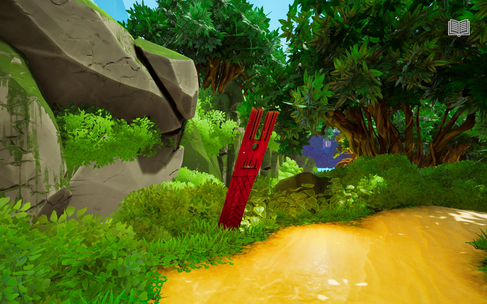
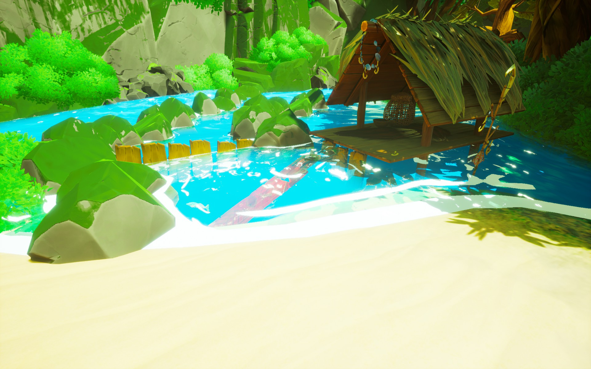
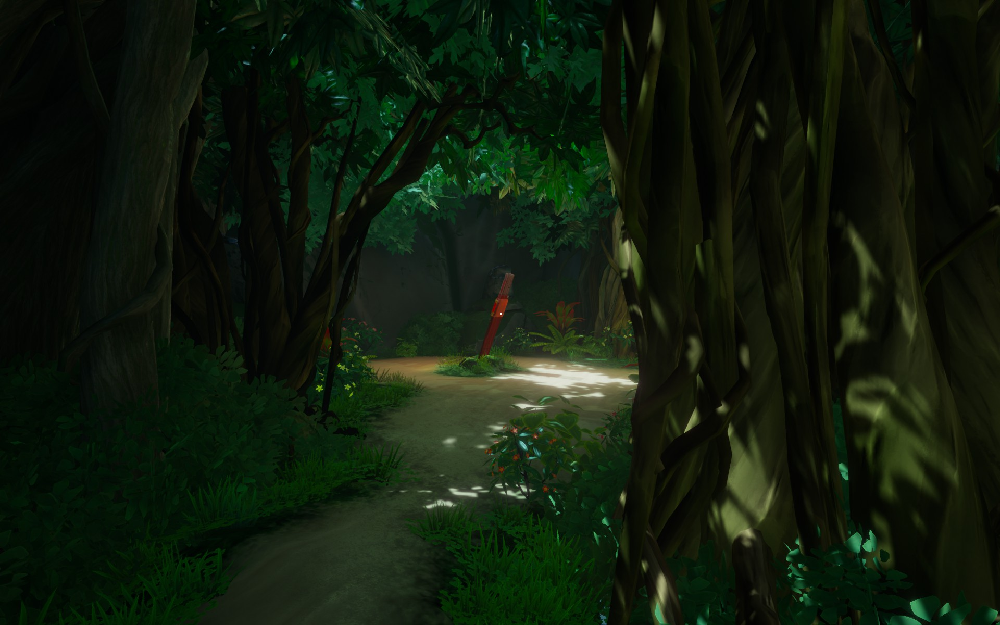
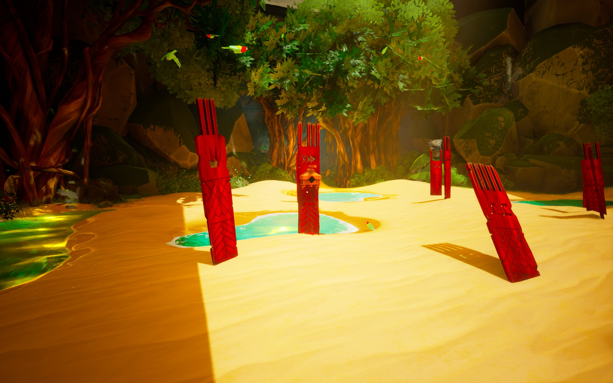
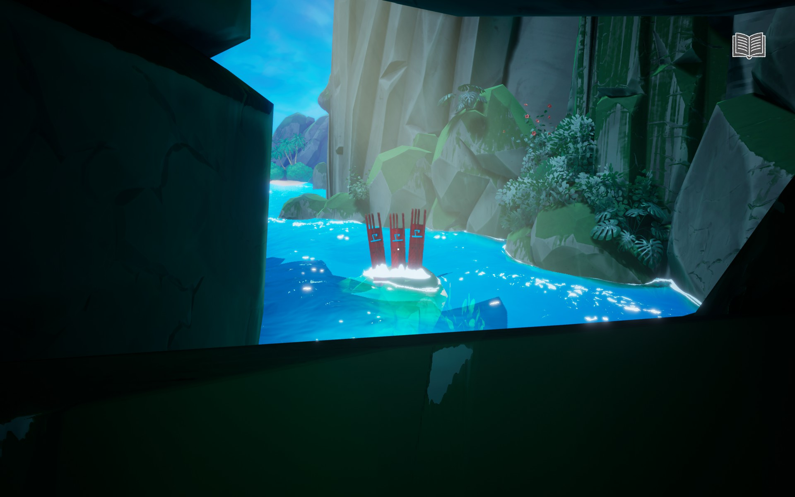

The symbols in the totem needs to be placed in correct order.

# Hint
The red *nunus* will help.

# Hint
Look at a *nunu* and Norah will draw into the journal what it means.

# Hint
You have to find all five *nunus*.
 - Mountain ^[  ]
 - Fish ^[  ]
 - Sun ^[  You have to move the shield. ]
 - Bird ^[  ]
 - Water ^[ Go left from the beach you arrived.  ]

# Hint
Now that you know all the symbols and their meanings put the symbols in correct order.

# Hint
Look behind the symbol totem.

# Spoiler

