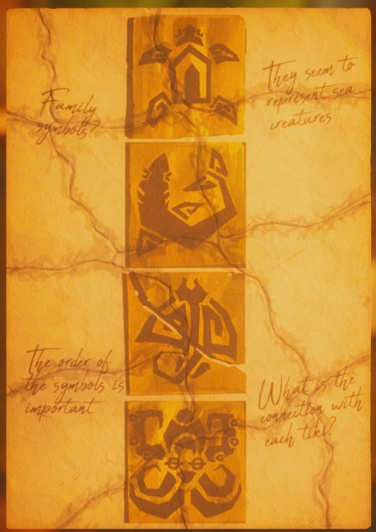
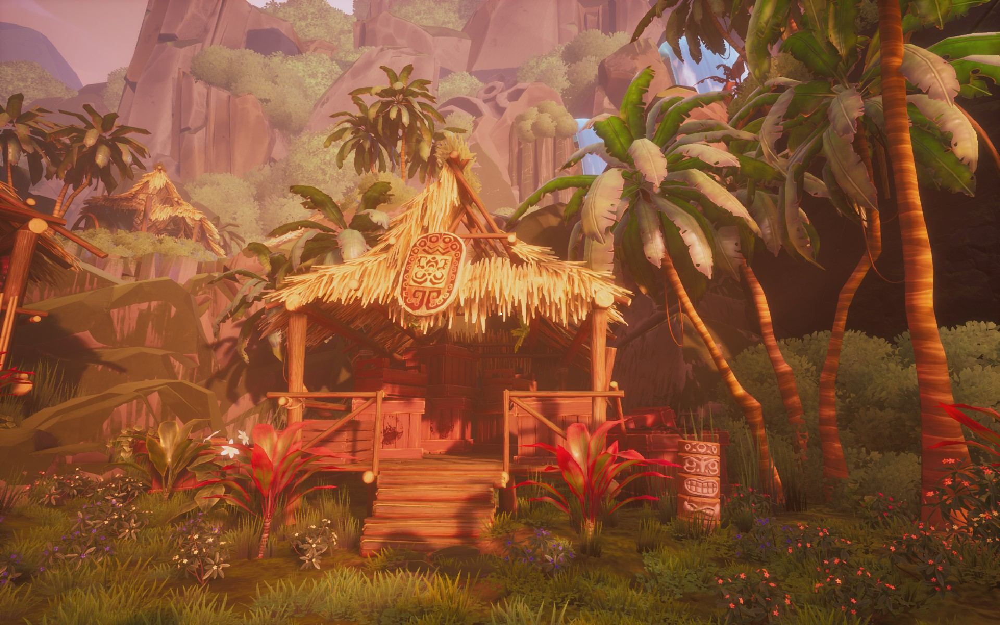
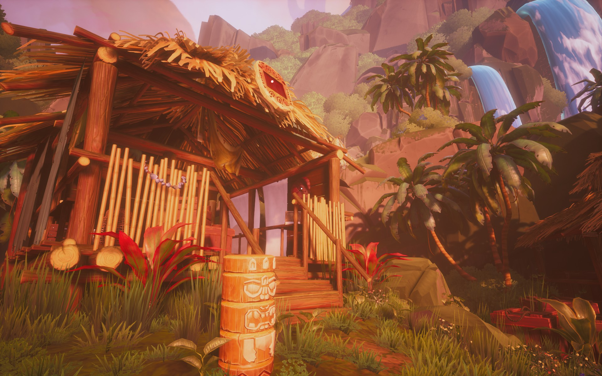
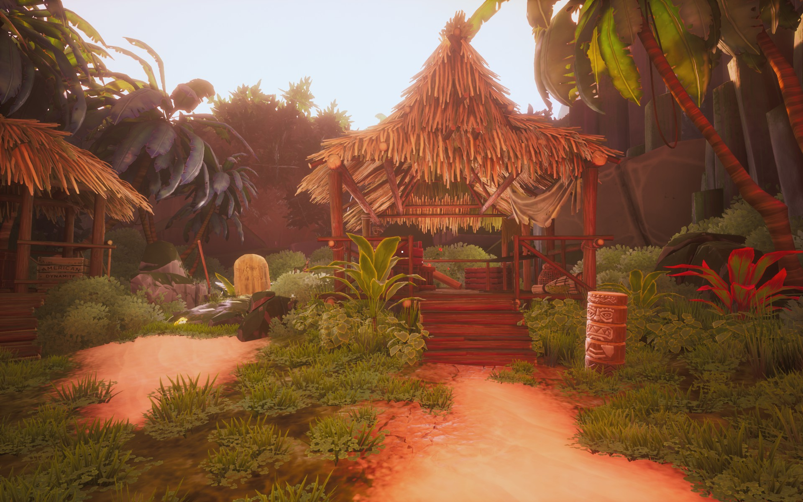
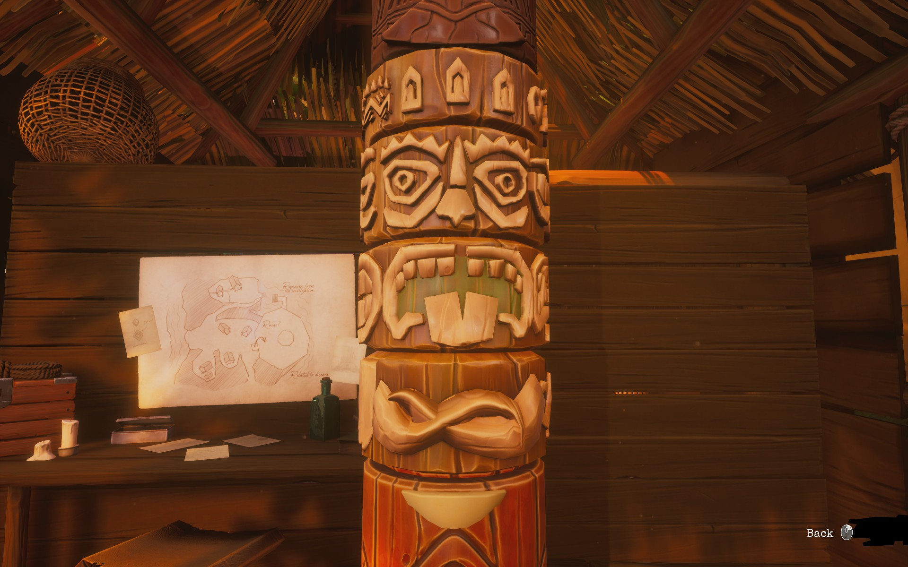

There is a tiki with movable columns up to the hill, in the first hut.

# Hint
The ripped paper on the table gives hints. Solve the paper. ^[  ]

# Hint
It reads:
_The order of the symbols is important_

and

_What is the connection with each tiki?_

# Hint
There are the four tikis in the area you entered in the beginning. ^[ One of the tikis is separated, near the grave. ]

# Hint
Each tiki is in front of a hut. There are four huts.

# Hint
There is an emblem with the sea creatures related to each hut, and thus the tiki. First one is clear, the **octopus** on top of the first hut.

# Hint

 - One of the huts is missing the square emblem entirely although the socket is there. ^[ This is the **turtle** emblem you find on the table in the upper hut. ]
 - One emblem is broken but it shows enough of the corner. ^[ This is the **bird** emblem. ]
 - The last hut, near the grave does not seem to have the emblem at all.

# Hint about the grave hut
Note the _shape_ of the emblems on other huts. ^[ Go into the hut to see the _back_ of the gravestone. There you can see the **fish** emblem. ]

# Hint
You should now have four tikis associated with four emblems. Remember to look all the tikis and the emblems so that Nora writes them into the journal. ^[ Conveniently the tikis and the emblems are in same order, respectively. ]

# Hint
Move the movable tiki's four parts according to the correct order. ^[ The order is shown in the solved paper and in the journal. So, first disc is from the turtle tiki, second one is from the fish tiki etc. ]

## Show the solution

