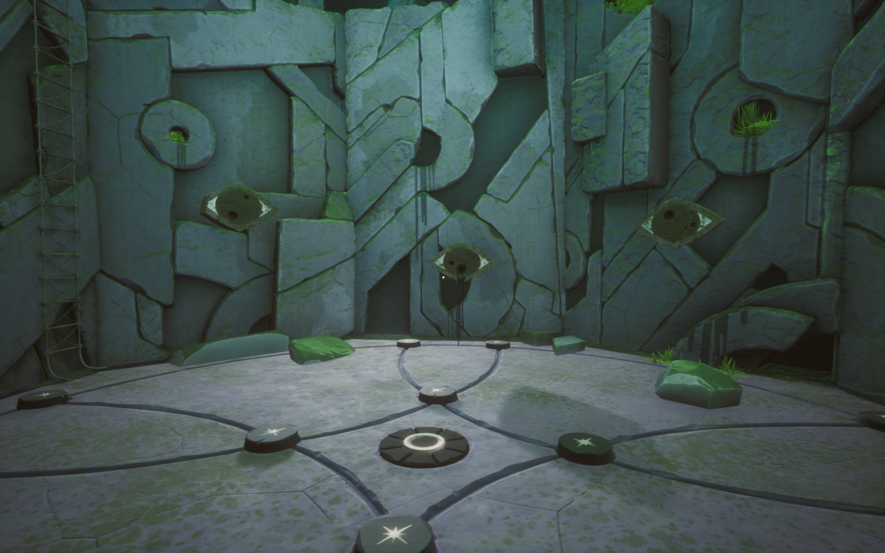
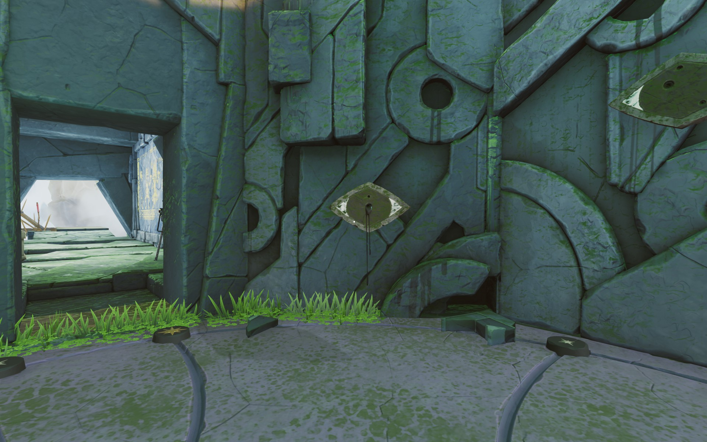
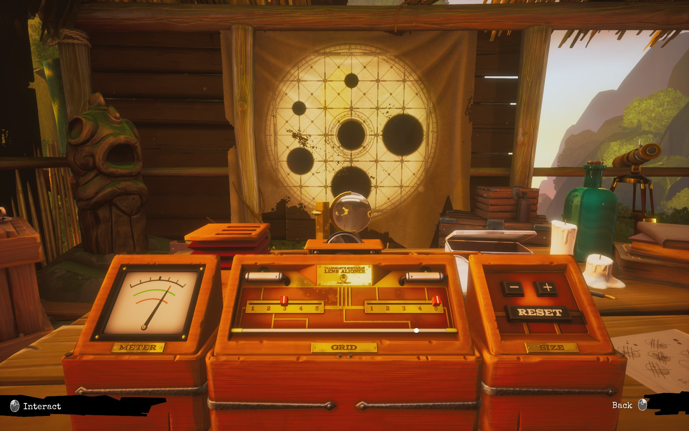

The lens aligner is started, after opening it, from the lever on the left. You can move the hotspot (the red point) in the 5x5 grid. From the - and + buttons you can increase or decrease the black spots on the lens. A black spot can be in three different sizes. Reset button will just start the puzzle from the beginning.

# Hint
The notes on the table don't help. They are wrong solutions. This thing has something to do with the *black ooze*.

# Hint
The hints for this puzzle are found somewhere else than this hut.

# Hint
[Get to the outcrop.](02-slab.md)

# Hint
Get down into the chasm.

# Hint
There's whispers. They get louder in some parts of the chasm.

# Hint
Approach the one *eye* that is dripping the black ooze. Look at it.

# Hint
Look around. Is there another eye dripping now, too? ^[  ]

# Hint
And a third one. ^[ [Third eye](third_eye.jpg) ]

# Hint
She drew the three eyes, with their *pupils* into the journal.

# Hint
Could those be somehow related to the lens aligner?

# Hint
You have to burn the holes according to the drawings.

# Hint
You have to burn the holes into *one lens* so that it contains *all* the black spots from Nora's drawings.

## Show the solution

Take the lens.
