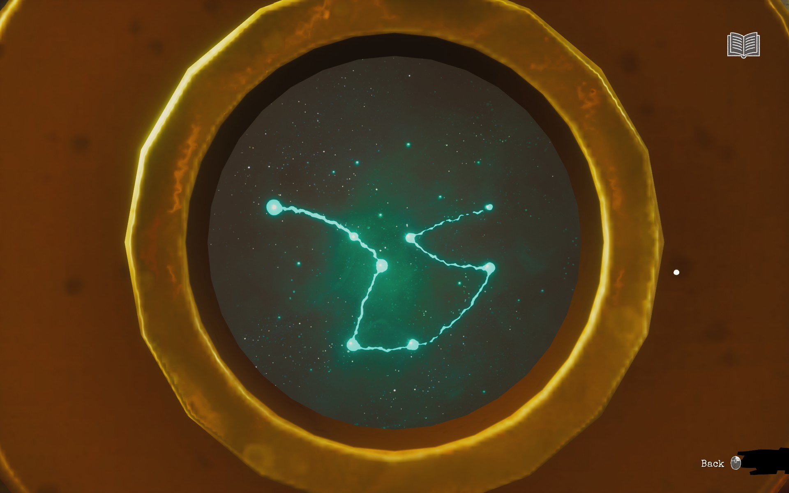
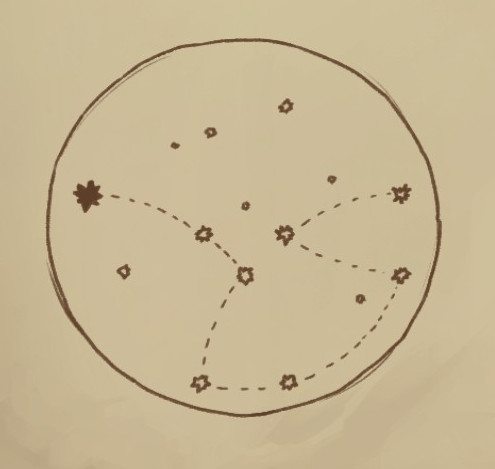
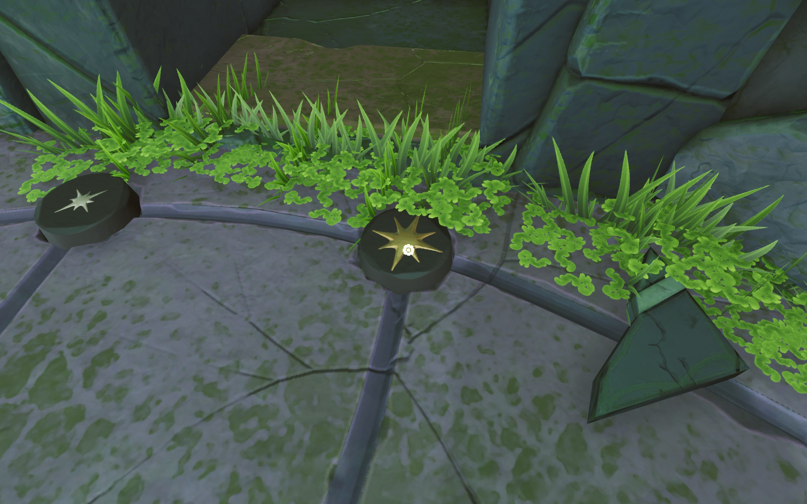
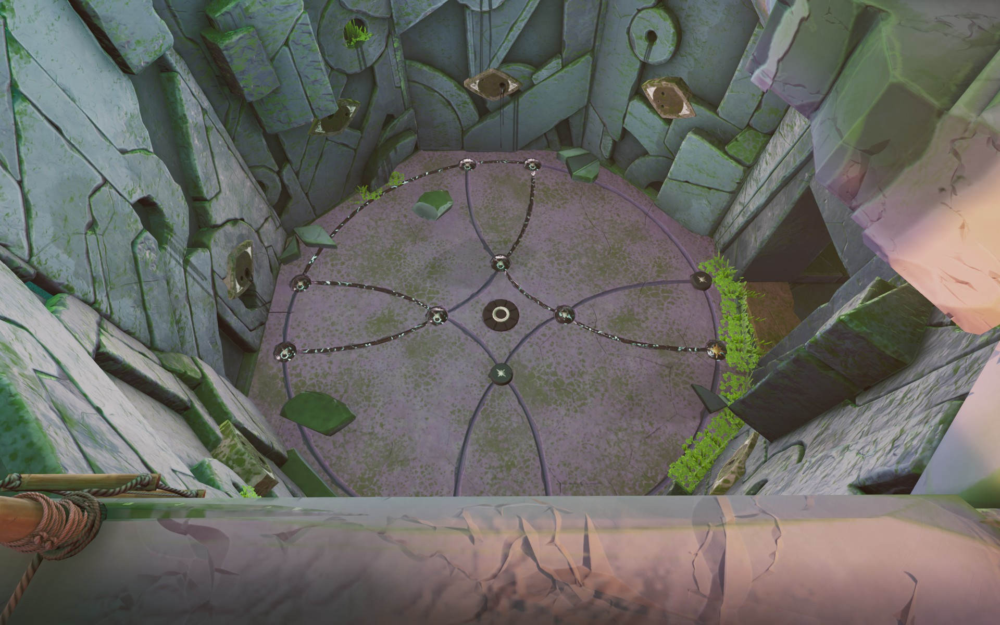

There's star shaped tiles in the floor at the excavation site chasm. When you push them they will form "connections" between them.

# Hint
You will get a clear hint for this after solving other puzzles.

# Hint
[Prepare the lens with the lens device](03-lens-device.md)

# Hint
Put the lens into the telescope.

# Hint
The constellation is your hint for the star tiles.

# Hint
Note that one of the stars in Nora's drawing is bigger. That helps you.

# Hint
One of the star tiles is bigger than others.

# Hint
Starting from the big star follow the drawing.

## Show the solution

