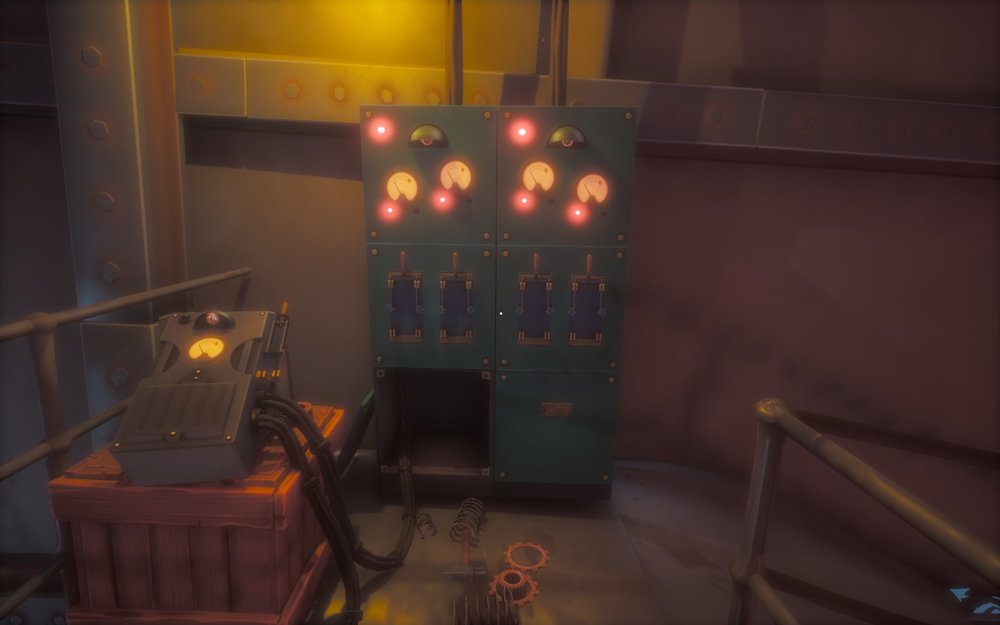

The lower camp is out of electricity.

# Hint
The ship provides electricity as long as it has fuel left.

# Hint
Go into the ship and find the main switches. ^[ Up the ladder and left. ]

# Hint
You have to turn the levers on in correct order. ^[ You have to try out. ]

# Spoiler
The correct order is (from left): third, second, fourth, first.

# Hint
Then follow the lines and switch on the smaller boxes. There are four of them (including the first one next to the main unit.)
