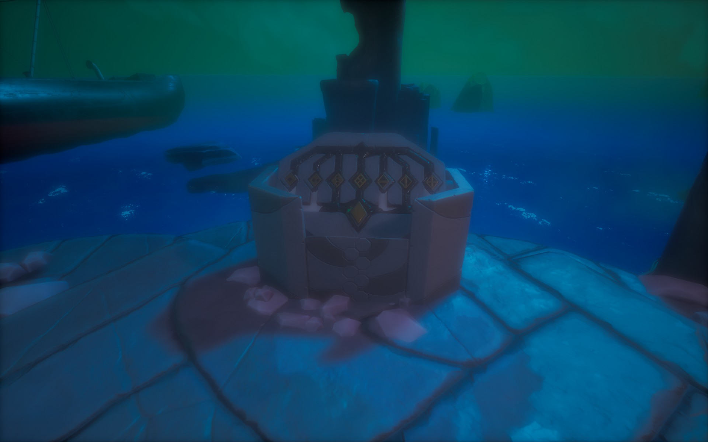
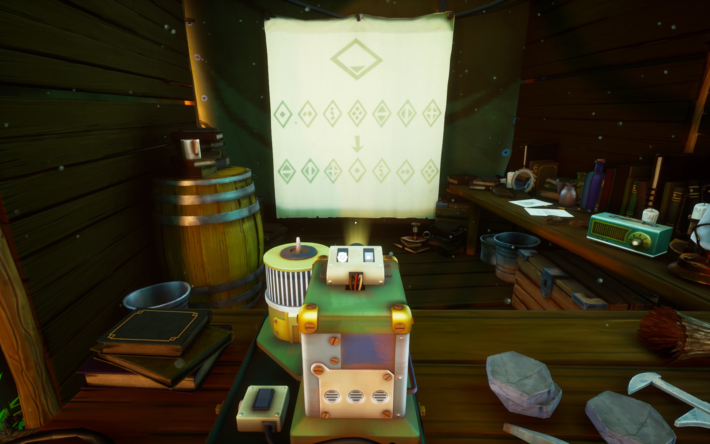
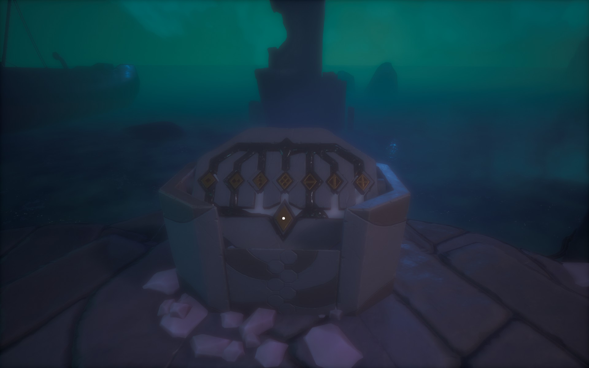

You have to set everything in correct order and push the big middle button to solve this puzzle. Look closely around the area to find all seven switches for the valves. Every switch has one symbol.

# Hint
Did you find the piano? ^[ The piano is at the *back* camp. ] It works when you [switch on the electricity](../01-electricity.md). 

# Hint
Every key in the piano corresponds to a three digit number. Nora will write these down into the journal. ^[ Play all the keys to get all the numbers. ]

# Hint
Right from the piano, in the box, is a paper that links symbols to the piano keys. Those are the same symbols that are in the organ.

# Hint
You just have to find out what keys, or numbers, or hertz, to put **on** in the organ. ^[ Look at the box next to the organ. The valves are on when stone slab is moved *up*. ]

[Here you can find the three numbers.](../03-three-rocks.md)

# Hint
You have the numbers

262 Hz ... 349 Hz ... 415 Hz

# Hint
Those hertzes correspond to the piano keys, and to the symbols.

# Hint
Have you gone through the papers in the camp.

# Hint
There's mentions about how the sea level affects the organ.

# Hint
Walk right from the organ, stairs down. There you can see symbols indicating the height of the tide.

# Hint
Those symbols were presented somewhere else, also.

# Hint
Look trhough the slideshow with the projector.

# Hint
This slide is particulary interesting. ^[ Look at it to get it into the journal. You have to have the current tide height in the journal already. ]

# Hint
It tells you how the symbols should be *tuned* according to the tide height.

# Hint
So, turn on the symbols for 262, 349, 415 turned into correct ones.

# Spoiler
The organ should look like this:

Click the button.

# Hint
The round hole should be [in correct position](02-hole.md), also.
