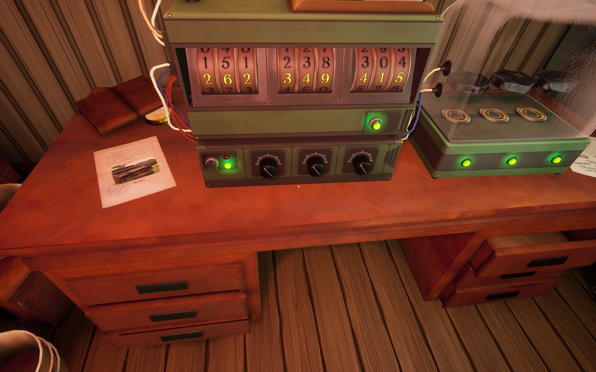

There is a science experiment in the ship that involves three rocks. You need to get them all to resonate on the correct level. The device is switched on from the lever in the left.

# Hint
Turn the three black knobs and the rocks move. When a rock is in correct place (in the middle) the green light turns on.

# Hint
One knob will move *two* rocks.
 - Left knob moves *first* and *third* rock
 - Middle knob moves *first* and *second* rock
 - Right knob moves *second* and *third* rock

# Hint
I suggest you reset all the knobs, first. Then the stones are all the way down.

# Hint
Then experiment and try to get them all in the middle. Remember:
 - Left knob moves *first* and *third* rock
 - Middle knob moves *first* and *second* rock
 - Right knob moves *second* and *third* rock

## Spoiler
Reset all the knobs. Then move all of them (no matter the order) *four clicks* up.

