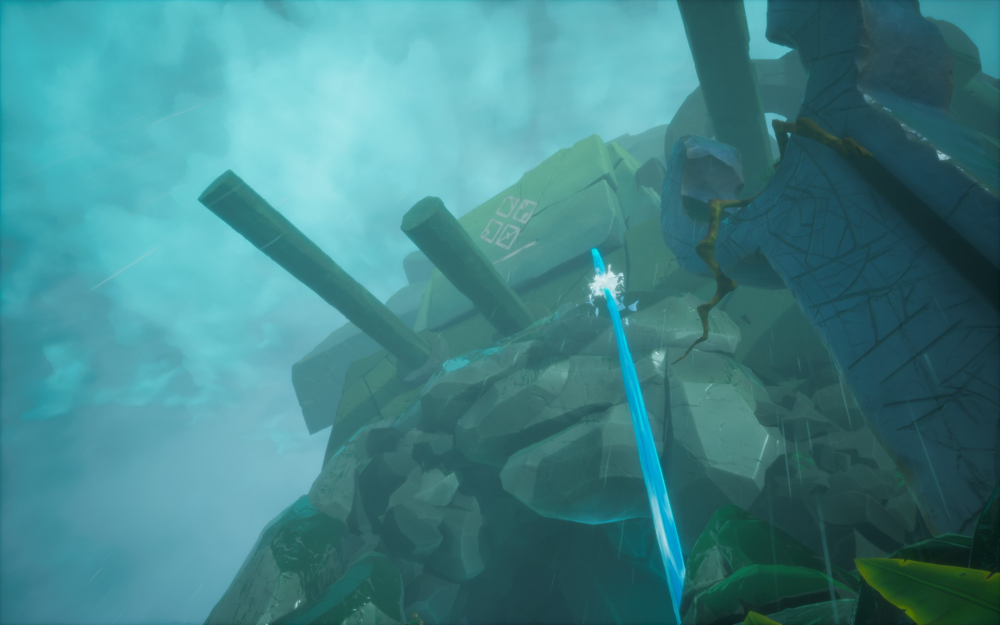
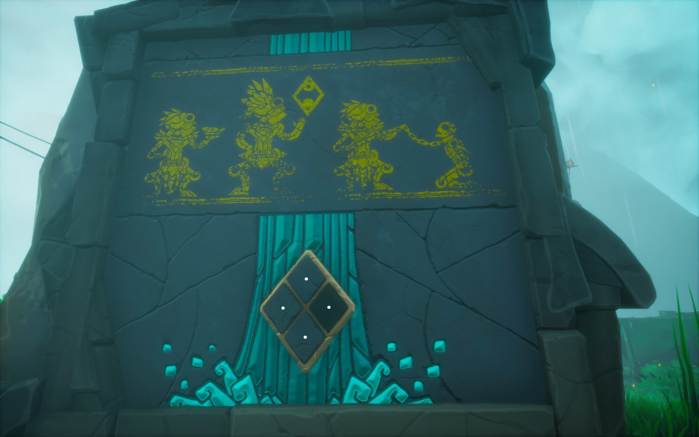
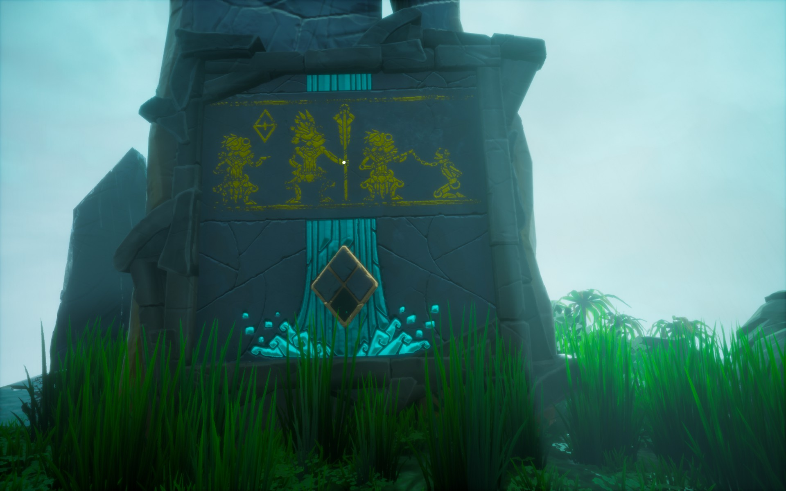
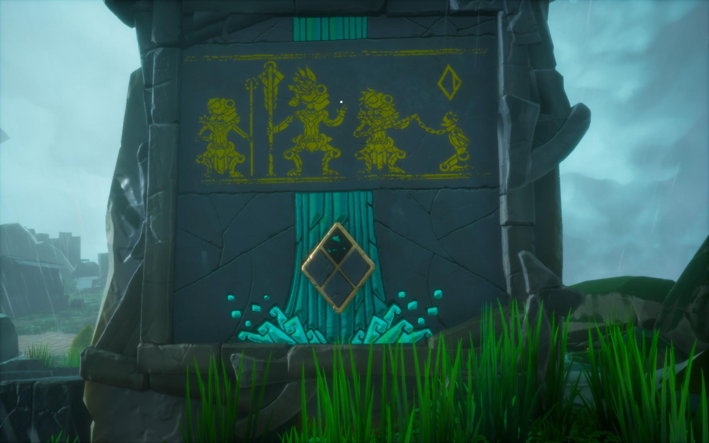
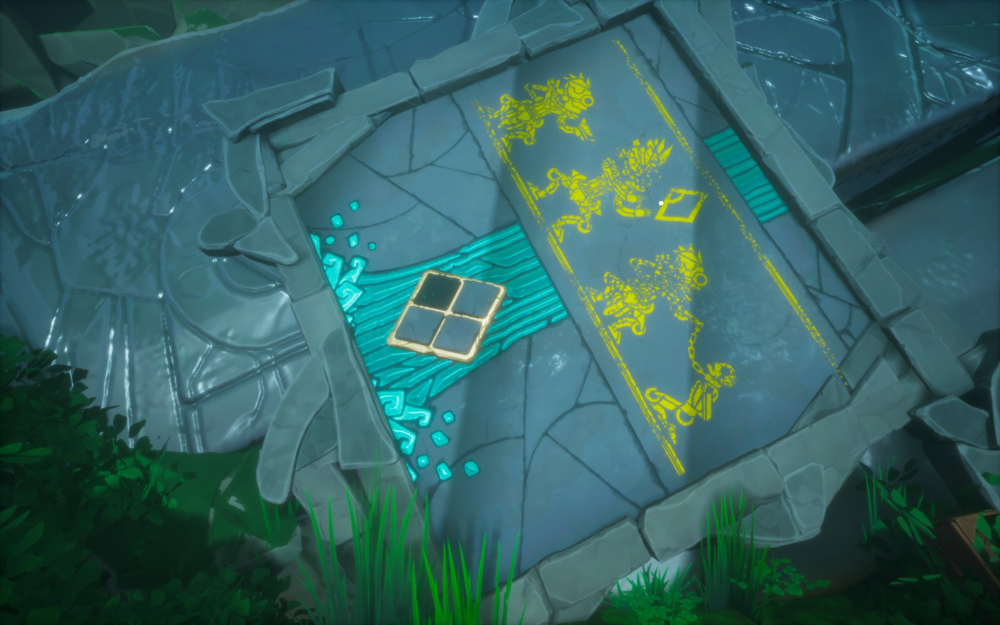

The waterfall is not hitting the turbine.

# Hint
Look up the waterfall. You see a symbol. It is the same symbol that is in the empty pool.

# Hint
There's corresponding symbols on those stone slabs with the four stone switch.

# Hint
It is important which way the strange symbol is.

# Hint
By pushing the stones down you denote where the slabs symbols belongs.

## First solution
For example, the slab with the two circle symbol should be in right. So push down the right stone.

## Two more
Here's two more

## The last one
One of the slabs is behind the fallen rocks. Go down to find it.

