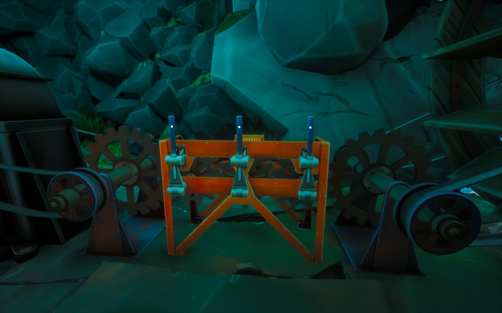
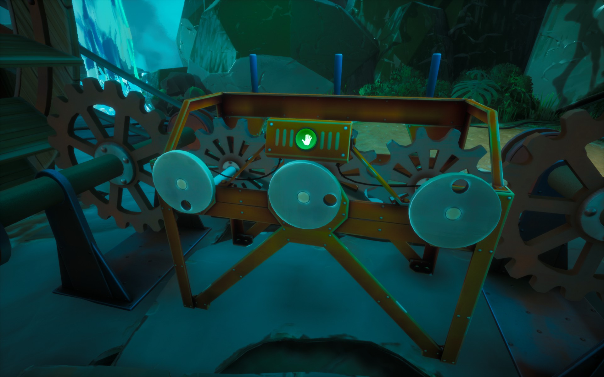

The wheel is moving but the generator is not working.

# Hint
You have to connect the wheel to the generator.

# Hint
Pull from the levers.

# Hint
You get the levers to move from the other side.

# Hint
Start from the right lever (left disc in the behind).

# Hint
When the first lever (right one) is in place go to the back and rotate the discs so that the hole is in the bottom for the next lever and so on.
