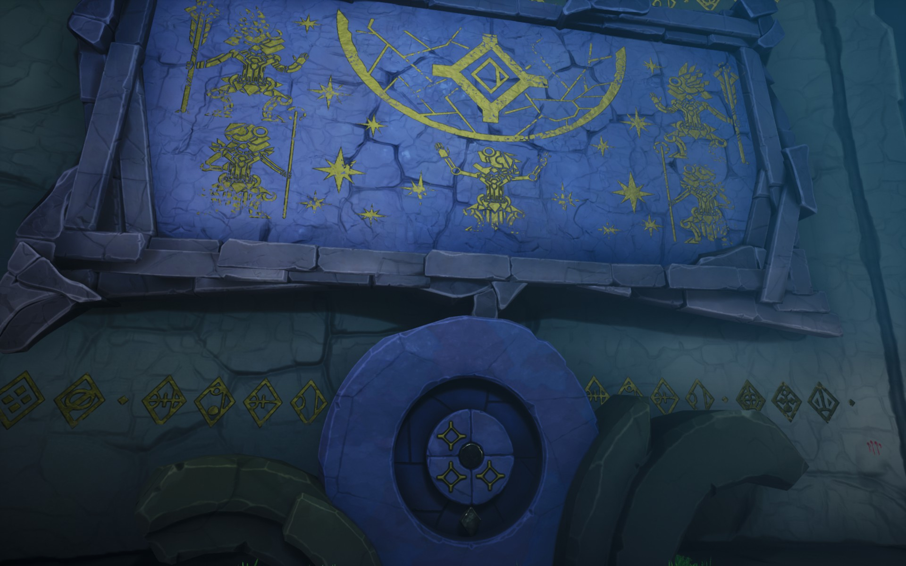

Your goal is to open the door. Look around for clues.

# Hint
Look for the papers that tell what the symbols mean.

# Hint
Look at the big murals that show the symbols. They are connected in your diary.

# Hint
Look at the book. ^[ Combining symbols create words. ]

# Hint
The symbols (on the murals) will combine with other symbols from other murals.

# Hint
Read the wallet. ^[ Rotating the "north" in th wheel defines in which quadrant the symbol is active (the symbol on the wheel shows the active quadrants). ]

# Hint
Try to roate the wheels so that you can create the found combinations.
 - God's Blood ^[  ]
 - Eternal Life ^[  ]
 - Water Animal ^[  ]
 - Destined Inevitable Transformation ^[  ]

# Hint
For example, the Transformation should be like this.

# Hint
I will next show the others.

# Hint
Liquid:

Life:

Eternal:

