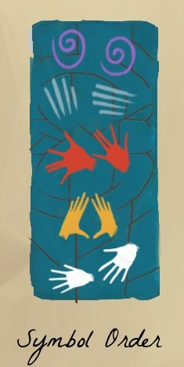

There are those huts with odd symbols.

# Hint
And each hut (and thus, a symbol) has a button somewhere near them.

# Hint
There must be an order in which to push the buttons.

# Hint
Look around. Go down the tunnel that gets you near the water.

# Hint
There is a column with one of the symbols (the hands).

# Hint
Look around the column. Look at the symbols to mark them in the diary.

# Hint
Push the buttons near the huts in the symbol order from bottom to top.

# Hint
 1. White hands hut
 2. Yellow hands hut
 3. Red hands hut
 4. Lines hut
 5. The "reset" button next to swirly hut
