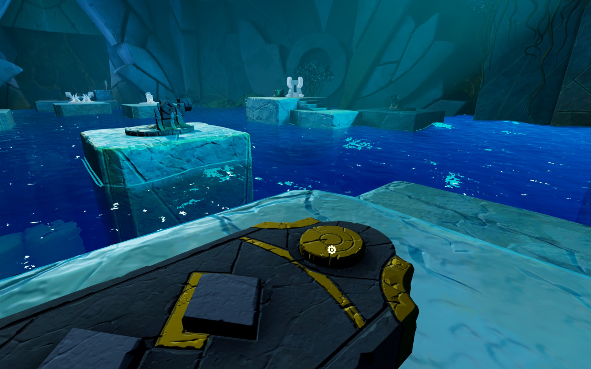
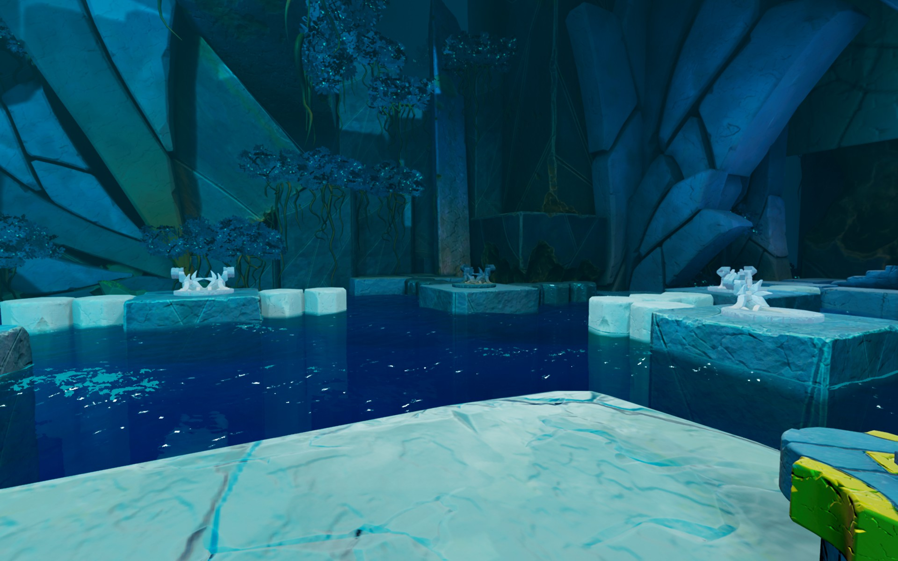
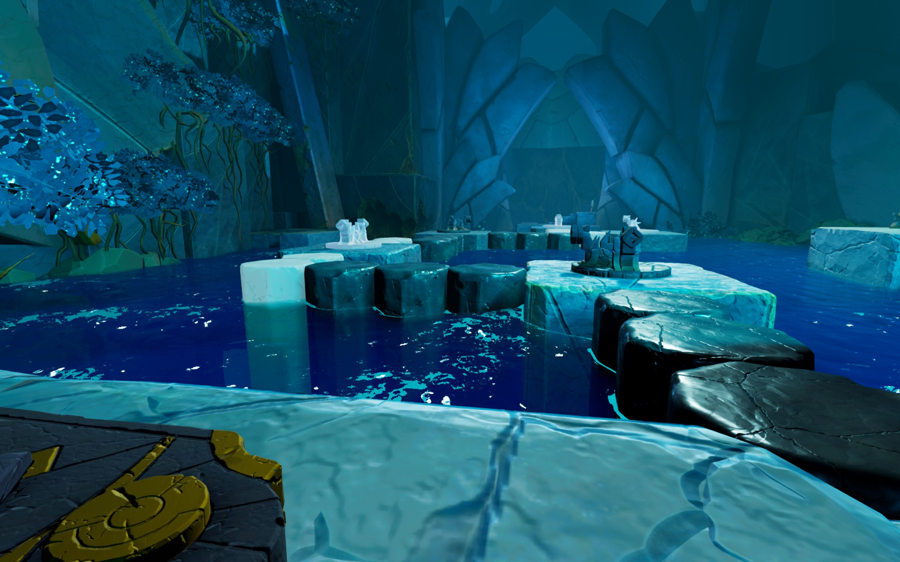

Behind one of the star doors are the dog statues.

# Hint
The yellow button will raise the bridges in the directions where the dog statues point.

# Hint
First, create, with the black bridges, a way to the other control unit.

## Hint
You need to click the middle button so that the nearest black dog points right. Click the right button so that the right dog points the other.

## Hint
Turn the white ones so that they form a way all the way back

## Hint
Finally, turn the black dogs so that they complete the way.

