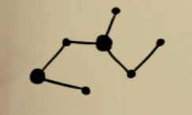

There are four doors with star constellations on them. Go look at all four doors.

# Hint
The middle pentagon must be the key.

# Hint
Activate it by pushing the two buttons.

# Hint
When you look throug the holes on the discs you can light up "stars". Notice especially the bigger stars.

# Hint
Try to create this constellation first:

# Hint
Here's how it should look when you look at it from the stairs with the eye-star.

# Hint
When you go behind the first door you get more tattoos and can activate different star formations.

# Hint
Try to create this constellation next:

# Hint
Here's how it should look when you look at it from the stairs with the eye-star.

# Hint
Try to create eithe or these constellations next:
 
Solution to above: ^[  ]

Solution to above: ^[  ]
